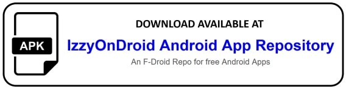

 
 
 
 
 
 

# Snapdrop for Android
**Snapdrop for Android** is an android client for the free and open source local file sharing solution https://snapdrop.net/. 

>Do you also sometimes have the problem that you just need to quickly transfer a file from your phone to the PC?
>
> - USB? - Old fashioned!
>
> - Bluetooth? - Much too cumbersome and slow!
>
> - E-mail? - Please not another email I write to myself!
> - Snapdrop!

Snapdrop is a local file sharing solution which completely works in your browser. A bit like Apple's Airdrop, but not only for Apple devices. Windows, Linux, Android, IPhone, Mac - no problem at all!

However, even if it theoretically would fully work in your browser and you don't have to install anything, you will love this app if you want to use Snapdrop more often in your daily life. Thanks to perfect integration into the Android operating system, files are sent even faster. Directly from within other apps you can select Snapdrop to share with. Thanks to its radical simplicity, "Snapdrop for Android" makes the everyday life of hundreds of users easier. As an open source project we have don't have any commercial interests but want to make the world a little bit better. Join and convince yourself!

  

## Where can I download the app?
New releases are always listed up at the [GitHub releases page](https://github.com/fm-sys/snapdrop-android/releases/). If you prefer an F-Droid repo, you can use the binary repo [IzzyOnDroid](https://apt.izzysoft.de/fdroid/repo?fingerprint=3BF0D6ABFEAE2F401707B6D966BE743BF0EEE49C2561B9BA39073711F628937A) which you can add to your F-Droid client. However, I take no responsibility for the content offered there.

## Contributing

**Snapdrop for Android** originally coded by [fm-sys](https://github.com/fm-sys) would like to become a community project. I invite your participation through issues and pull requests! There are still some things which need to be fixed…

Also bug reports are very welcome! But note that this is not the right place to report bugs regarding the Snapdrop website which occur independently of this app.

## credits
- RobinLinus for [Snapdrop website development](https://github.com/RobinLinus/snapdrop) and the [launcher icon](https://github.com/RobinLinus/snapdrop/blob/663db5cbb39ab804b20f9cb6466effd9ed0e2d0c/client/images/logo_blue_512x512.png)
- material design icons 
